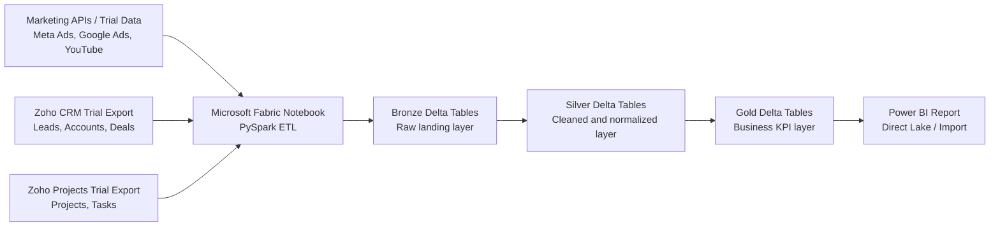

# Architecture Diagram

## Layer Mapping

- Bronze: `bronze_meta_ads`, `bronze_google_ads`, `bronze_youtube_analytics`, `bronze_crm_leads`, `bronze_crm_accounts`, `bronze_crm_deals`, `bronze_projects`, `bronze_tasks`
- Silver: `silver_marketing_leads`, `silver_sales_leads`, `silver_accounts`, `silver_deals`, `silver_projects`, `silver_tasks`
- Gold: `gold_marketing_performance`, `gold_sales_pipeline`, `gold_sales_to_projects`, `gold_project_delivery`, `gold_executive_kpis`

## Operational Notes

- Pipeline supports incremental ingestion using timestamps (`created_date` / `close_date` / `start_date`) to avoid full reloads.
- Basic resiliency pattern is included: notebook ingestion logic is designed for retry + logging on failure conditions.
- Silver layer applies data quality checks such as null handling, deduplication, and schema normalization.
- Data lineage is maintained from raw ingestion (Bronze) to business KPIs (Gold) for traceability.
- Architecture is scalable and can support orchestration through Fabric Pipelines and near-real-time ingestion through event streams and Cosmos DB change feed.
